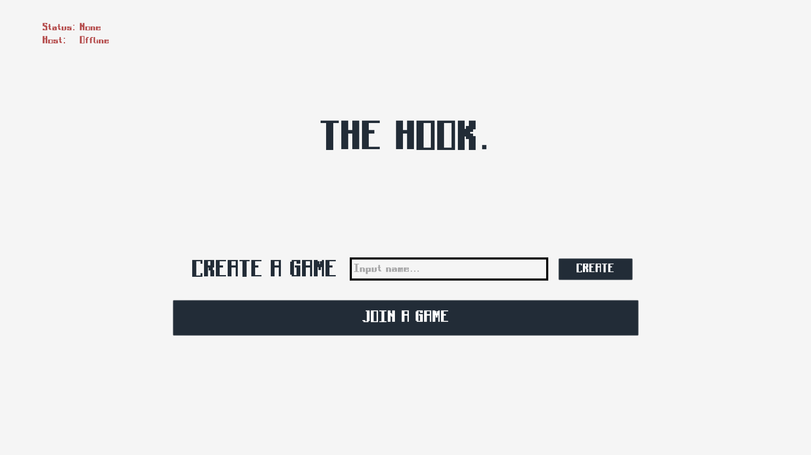
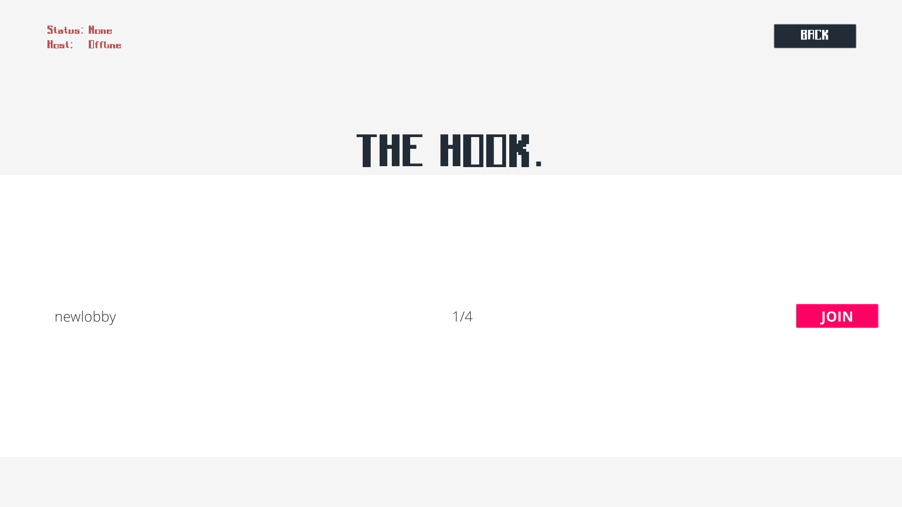
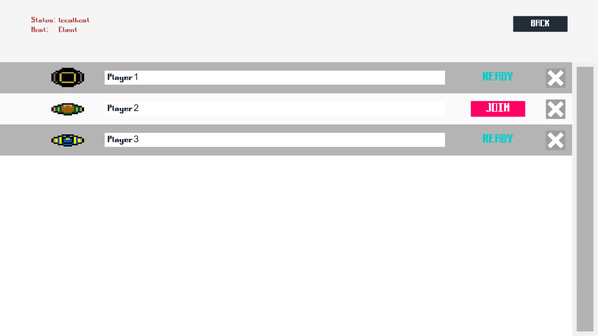
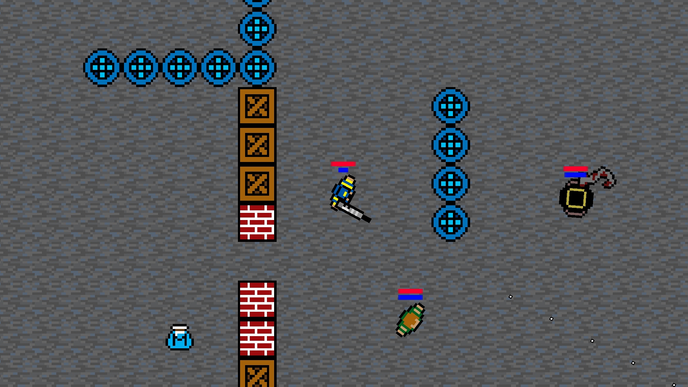

# The Hook

## The Game
Three survivors team up to kill The Hook, before he kills them.
- Each character has its own specialties and its set of three abilities:
    - Tank : High health and low mobility.
        - Block
        - Dash
    - Healer : Low health and high mobility.
        - Heal (health regeneration spell targeted to a nearby ally)
        - Resurrect (brings an ally back from the dead)
    - Damage : medium health, low mobility
        - Can pick up weapons to kill The Hook
    - The Hook: High health and high mobility. Villian.
        - Hook enemies towards yourself, hook walls to grapple around
- All abilities are subject to independent cooldowns and mana costs.
- The map is randomly generated.
- Weapons will appear randomly around the map as well as power ups (mana regen) that are applied to the hero that picks it up.
---
Join or create a game:

Choose your class & play:

